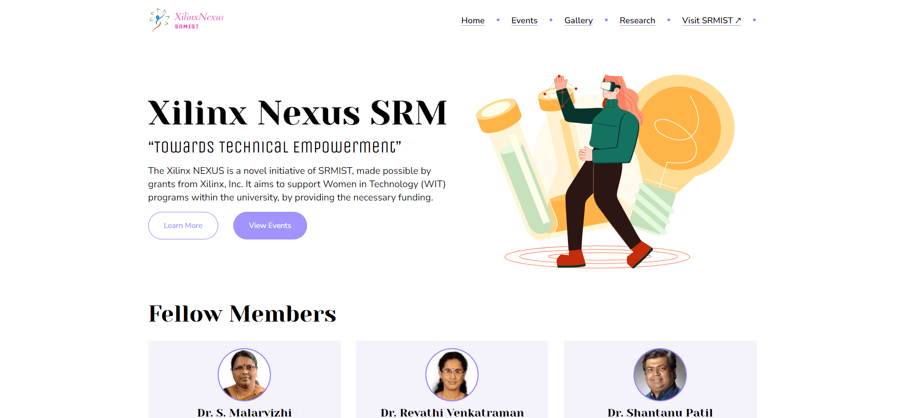

# Xilinx Nexus SRM

<p align="center">
    
</p>

**Table of Contents**:

- [Preface](#-preface)
- [Getting Started](#-getting-started)
  - [Clone this Repository](#clone-this-repository)
  - [Install Packages & Dependencies](#installing-packages--dependencies)
  - [Start Application](#start-application)
- [Contributing](#-contributing)
  - [Project Contributors](#project-contributors)
- [License](#-license)

## 💡 Preface

The Xilinx NEXUS is a program initiated by SRMIST to support Women in Technology (WIT) programs within the university. This innovative program is made possible by grants from Xilinx, Inc.

This static website is developed using React, Typescript and Tailwind CSS.

## 🚀 Getting Started

### Clone this Repository

```bash
git clone https://github.com/kunalkeshan/Xilinx-Homepage.git
```

### Installing Packages & Dependencies

- Install using Yarn.

```bash
yarn
```

- Install using NPM.

```bash
npm install
```

### Start Application

Start using Yarn.

```bash
yarn start
```

Start using NPM.

```bash
npm start
```

## 🤖 Contributing

Anybody is free to contribute to this repo. If you think that you can improve the model or the gui, follow the contributing guidelines mentioned at [CONTRIBUTING.md](/CONTRIBUTING.md)

### Project Contributors

<a href="https://github.com/kunalkeshan/Xilinx-Homepage/graphs/contributors">
  
</a>

## 🔐 License

This project is licensed under the [MIT License](/LICENSE).

### Forking this Repo?

Many people have contacted us asking if they can use this code for their own websites. The answer to that question is usually "yes", with attribution. There are some cases, such as using this code for a business or something that is greater than a personal project, that we may be less comfortable saying yes to. If in doubt, please don't hesitate to ask us.

We value keeping this project open source, but as you all know, plagiarism is bad. We actively spend a non-negligible amount of effort developing, designing, and trying to perfect this iteration of our project, and we are proud of it! All we ask is to not claim this effort as your own.

So, feel free to fork this repo. If you do, please just give us proper credit by linking back to this repo, [https://github.com/kunalkeshan/Xilinx-Homepage](https://github.com/kunalkeshan/Xilinx-Homepage). Refer to this handy [quora](https://www.quora.com/Is-it-bad-to-copy-other-peoples-code) post if you're not sure what to do. Thanks!
